<div align="center">



</div>

> 🎬 **The diagrams are alive** — pure-CSS animations baked into the SVGs (floating cubes,
> flowing request arrows, pulsing status lines). GitHub renders them natively; they honor
> `prefers-reduced-motion`. No JS, no GIFs, no image hosting.

## 🎨 Pick your theme

Four full color themes ship in [`docs/assets/`](docs/assets/) — every diagram in every theme:

| | | |
|---|---|---|
| 🔥 **ember** *(default)* |  | butter & espresso |
| 🌌 **midnight** |  | tokyo-night blues |
| 🍵 **matcha** |  | green tea & cream |
| 🫐 **berry** |  | plum & rosé |

Switch the whole README in one command:

```bash
sed -i 's#docs/assets/[a-z]*/#docs/assets/midnight/#g' README.md   # or matcha / berry / ember
```

<div align="center">


*A production-grade e-commerce platform for an artisan bakery — built the way real platforms are built.*

[⚡ Quick Start](#-quick-start-one-command) · [🏗 Architecture](#-architecture) · [📖 Swagger UI](#-api-docs--swagger-ui) · [🛒 Checkout Pipeline](#-the-checkout-pipeline) · [🔌 Port Map](#-one-service-one-port) · [☸️ Kubernetes](#️-deploying-to-kubernetes) · [🛠 Troubleshooting](#-troubleshooting)

</div>

---

## ⚡ Quick Start (one command)

> The entire platform — database, cache, gateway, 22 services, storefront — on any machine with Docker.

```bash
docker compose up --build -d        # or: make up
```

| What | Where | Credentials |
|---|---|---|
| 🥐 **Bakery storefront** | http://localhost:8080 | — |
| 📖 **Swagger UI** | http://localhost:3000/api/docs | — |
| 🚪 **API gateway** (route index) | http://localhost:3000/api | — |
| 🩺 **Platform health** | http://localhost:3000/api/status | — |
| 🗄 **Adminer (DB UI)** | http://localhost:8081 | server `postgres` · `bakery` / `bakery` |
| 🐘 **PostgreSQL** | localhost:5432 | `bakery` / `bakery` |
| 👤 **Demo login** | `amelie@crumbandember.dev` | `baguette` |
| 🎟 **Promo codes** | `CRUMB10` · `DAYOLD50` | −10% / −50% |

```bash
make smoke      # login → token verify → cart in Redis → order in Postgres ✅
make logs       # live JSON log firehose from all 26 containers
```

---

## 🏗 Architecture



One entry point, two paths: Traefik sends `/` to the nginx storefront and `/api` to the
gateway, which stamps every request with an `x-request-id` and proxies to the owning
domain service on **its own port**. Carts live in Redis with a 7-day TTL; users,
products, orders, payments and invoices live in PostgreSQL. Cross-cutting concerns —
currency conversion and, as of this release, UI language/locale resolution — are their
own small stateless services (`currency-service`, `language-service`) sitting alongside
the domain services rather than inside any one of them.

---

## 📖 API Docs — Swagger UI

The gateway serves interactive documentation for all **50 endpoints across 22 services**,
with try-it-out enabled — no Postman required.

| Endpoint | Compose | Kubernetes |
|---|---|---|
| **Swagger UI** (interactive) | http://localhost:3000/api/docs | http://bakery.local/api/docs |
| **OpenAPI 3 spec** (Postman/Insomnia import) | http://localhost:3000/api/openapi.json | http://bakery.local/api/openapi.json |
| **Route index** | http://localhost:3000/api | http://bakery.local/api |
| **Live upstream health** (all services, one call) | http://localhost:3000/api/status | http://bakery.local/api/status |

---

## 🛒 The Checkout Pipeline



One click in the storefront drives seven services, and the UI narrates each hop live:
*"Order o_x91k2 received — taking payment… — scheduling delivery…"*. Every other service
is visible too:

| You see | Service behind it |
|---|---|
| 🧺 Basket icon + live badge, slide-out drawer | **cart-service** (Redis, 7-day TTL) |
| 👤 Sign in / Register modal, guest-basket merge on login | **auth-service** (scrypt + HMAC tokens) |
| `27 in stock` / `only 3 left` / `sold out` badges | **inventory-service** |
| Net / VAT / total in the basket | **pricing-service** `/quote` |
| Promo box — try `CRUMB10` or `DAYOLD50` | **promotion-service** |
| ★★★★★ reviews, read & post per product | **review-service** |
| Header search box | **search-service** |
| "Pairs well today: …" | **recommendation-service** |
| 🔴 Out-of-the-oven rail, past bakes struck through | **baking-schedule-service** |
| Footer health grid — one dot per service, 30 s refresh | gateway **`/api/status`** |
| Every click tracked | **analytics-service** |

---

## 🔌 One Service, One Port

Each service listens on its own port (`PORT` env → compose host port → k8s Service/containerPort):

| Port | Service | Port | Service |
|---|---|---|---|
| **3000** | api-gateway | 3011 | review-service |
| 3001 | auth-service | 3012 | search-service |
| 3002 | user-service | 3013 | recommendation-service |
| 3003 | product-catalog-service | 3014 | promotion-service |
| 3004 | inventory-service | 3015 | loyalty-service |
| 3005 | pricing-service | 3016 | recipe-service |
| 3006 | cart-service | 3017 | baking-schedule-service |
| 3007 | order-service | 3018 | supplier-service |
| 3008 | payment-service | 3019 | analytics-service |
| 3009 | delivery-service | 3020 | media-service |
| 3010 | notification-service | 3021 | invoice-service |
| 3022 | currency-service | 3023 | language-service |

*(Frontend 8080 · Adminer 8081 · Postgres 5432 · Redis internal.)* In compose you can
bypass the gateway and hit any service directly:

```bash
curl http://localhost:3006/carts/guest          # cart-service, straight to Redis
curl http://localhost:3003/products             # product-catalog, straight to Postgres
curl http://localhost:3017/schedule/today       # what's in the oven right now
```

---

## 📜 JSON Logging

Every container — Node services *and* nginx — emits one-line structured JSON on stdout,
ready for Fluent Bit / Loki / ELK, joined end-to-end by `x-request-id`:

```json
{"level":"info","time":"2026-07-10T15:04:05.123Z","service":"api-gateway","event":"proxy_request",
 "upstream":"http://order-service:3007","path":"/orders","status":201,"durationMs":14,"requestId":"req_k3x9d2ab"}
```

```bash
docker compose logs -f | grep req_k3x9d2ab     # follow one request across every hop
```

---

## ☸️ Deploying to Kubernetes

22 Deployments with readiness/liveness probes, non-root + read-only rootfs + dropped
capabilities, HPA (2–6) on the gateway, PodDisruptionBudgets on the edge, Traefik Ingress.

```bash
# 1. Build & push (replace with YOUR registry — this is the #1 gotcha)
export REG=ghcr.io/<you>/bakery-microservices
for d in services/*/; do s=$(basename $d); docker build -t $REG/$s:latest $d && docker push $REG/$s:latest; done

# 2. Point manifests at your registry
grep -rl 'YOUR_GITHUB_USERNAME' k8s/ | xargs sed -i "s#ghcr.io/YOUR_GITHUB_USERNAME/bakery-microservices#$REG#g"

# 3. Ship it
kubectl apply -f k8s/namespace.yaml
kubectl apply -f k8s/data/ -f k8s/services/ -f k8s/ingress.yaml -f k8s/policies.yaml
echo "<ingress-ip>  bakery.local db.bakery.local" | sudo tee -a /etc/hosts

# 4. Watch it come up
kubectl -n bakery get pods -w
curl http://bakery.local/api/status | jq
```

> The `k8s/` manifests above are the raw, single-environment path (handy for
> a quick local cluster). For UAT/Prod with environment-specific sizing and
> secrets management, use the Helm chart below instead — it's the
> recommended path and what CI/CD uses.

---

## ⎈ Helm — UAT & Prod, deployed by ArgoCD

The whole stack (25 microservices + Postgres + Redis + Adminer + Traefik
ingress) ships as one chart: [`charts/bakery`](charts/bakery). One values
file per environment layers on top of the shared defaults:

| File | Purpose |
|---|---|
| `charts/bakery/values.yaml` | Shared defaults (image registry, ports, probes, resource *presets*) |
| `charts/bakery/values-uat.yaml` | UAT: `bakery-uat` namespace, lean resources, 1 gateway/frontend replica |
| `charts/bakery/values-prod.yaml` | Prod: `bakery-prod` namespace, HPA'd gateway/frontend, TLS ingress, bigger Postgres/Redis |

### CI (GitHub Actions) vs CD (ArgoCD) — who does what

**GitHub Actions is CI only** (`.github/workflows/ci.yml`). It never holds a
kubeconfig or an application secret:

1. `build` — matrix-builds & pushes all 25 images to GHCR, tagged with the
   commit SHA.
2. `update-uat-image-tag` — bumps `global.imageTag` in
   `charts/bakery/values-uat.yaml` and pushes that one-line commit to `main`.
   That's it — the workflow ends there.

**ArgoCD is CD**, entirely separate:

- `argocd/uat-application.yaml` watches `charts/bakery` on `main` with
  `values-uat.yaml` layered on, and has `syncPolicy.automated` (prune +
  selfHeal) — so the commit from step 2 above is picked up and rolled out to
  UAT automatically, with no GitHub Actions job ever running `helm upgrade`
  or `kubectl apply`.
- `argocd/prod-application.yaml` watches the same path with
  `values-prod.yaml` instead, but has **no automated sync policy** — it will
  sit `OutOfSync` after a change until a human runs
  `argocd app sync bakery-prod` (or clicks *Sync* in the UI).

Promoting a tag from UAT to Prod is its own tiny workflow,
`.github/workflows/promote-to-prod.yml` (`workflow_dispatch`, optional
`image_tag` input — defaults to UAT's current tag). It only opens a Pull
ковRequest bumping `global.imageTag` in `values-prod.yaml`; **merging that PR
is the deploy approval**, and the follow-up `argocd app sync bakery-prod` is
a second, explicit gate. GitHub Actions still never touches the cluster.

```
push to main → CI builds & pushes images → CI commits new tag to values-uat.yaml
                                                     │
                                     ArgoCD auto-syncs UAT ◄┘

workflow_dispatch → opens PR bumping values-prod.yaml → human merges PR
                                                     │
                              argocd app sync bakery-prod (human) ◄┘
```

### Secrets — never in git, never in GitHub Actions

`secretsManagement.mode: external-secrets` in both `values-uat.yaml` and
`values-prod.yaml` means the chart renders `ExternalSecret` custom resources
(`templates/external-secrets.yaml`) instead of plain Secrets. The
[External Secrets Operator](https://external-secrets.io) (installed once per
cluster, outside this chart) reads the real `POSTGRES_PASSWORD`,
`AUTH_TOKEN_SECRET`, and Razorpay keys from your secret backend — Azure Key
Vault, AWS Secrets Manager, or Vault — and materializes them as ordinary
`bakery-db-secret` / `razorpay-credentials` Secrets in-cluster. Every
Deployment already reads those via `secretKeyRef`, so nothing else changes.
Update `secretStoreRef.name` and the `remoteKeys` paths in each values file
to match your backend.

Two other modes exist for flexibility:
- **`pre-provisioned`** — chart renders no Secret/ExternalSecret at all; you
  (or a one-time bootstrap script, run by a human, outside CI/CD) create
  `bakery-db-secret` / `razorpay-credentials` once per namespace. Use this if
  ESO isn't installed yet.
- **`helm-values`** — the chart's original behavior, for local/manual
  `helm install --set-string secrets.postgres.password=... ...` testing
  only. This is the default in `values.yaml` but both UAT and Prod override
  it to `external-secrets`, so nothing from this mode ever reaches a real
  environment.

### One-time ArgoCD bootstrap

```bash
kubectl apply -f argocd/project.yaml
kubectl apply -f argocd/uat-application.yaml
kubectl apply -f argocd/prod-application.yaml
```

(Update the `repoURL` placeholder in all three files to your actual git
remote first.)

---

## 🛠 Troubleshooting

| Symptom | Meaning | Fix |
|---|---|---|
| Storefront shows static data, footer says `degraded` | Gateway is up, some upstreams aren't | `curl /api/status` — it names the down services |
| Pods in `ImagePullBackOff` | Placeholder registry never replaced | Step 2 above; rebuild **all** images after the port change |
| `/api/xyz` → `No upstream for that path` | Prefix not in the route table | `GET /api` lists every valid prefix |
| Checkout stops at "taking payment…" | payment-service down or missing secrets | `kubectl -n bakery logs deploy/payment-service` |
| `bakery.local` unreachable | hosts entry / ingress IP | `kubectl -n traefik get svc` → add to `/etc/hosts` |

---

<div align="center">

**Baked with 22 services, zero magic, and a healthy respect for structured logging.** 🥖

*Diagrams are hand-built, CSS-animated isometric SVGs in [`docs/assets/`](docs/assets/) — four themes, zero image hosting, rendered natively by GitHub.*

</div>


## ✨ New: 3D colourful frontend

The frontend (`services/frontend/index.html`) is now a candy-bright, 3D-themed single-page app:

- **Three.js hero** — floating 3D donuts (with sprinkles), cupcake, macarons and croissants with mouse-parallax camera
- **Dimensional UI** — chunky offset shadows, 3D tilt-on-hover product cards, candy palette (strawberry / butter / pistachio / blueberry)
- **Full API integration** — products, baking schedule, reviews, cart, promos (`CRUMB10`), auth, checkout chain (order → payment → delivery → invoice → loyalty → notification), live platform status in the footer
- **Offline preview mode** — if the gateway is unreachable it falls back to the seeded menu and a local basket, so the page works standalone too
- The previous minimal frontend is kept at `services/frontend/index.legacy.html`
- **No platform internals are exposed to shoppers**: the customer frontend has no API-doc links, no service-status widget, and no error copy that names services or infrastructure. Operators still have everything at `/api/docs`, `/api/status` and `/api` on the gateway (port 3000) — it's just not linked from the storefront.

### 💱 New: currency-service (port 3022)

A dedicated currency-conversion microservice at `/api/currency` with **47 currencies** — INR ₹, AED د.إ (UAE Dirham), CNY ¥ (Chinese Yuan), GBP £, JPY ¥, USD $, KRW, SAR, BRL, ZAR and many more:

- `GET /api/currency` — all currencies with names, symbols, decimals and EUR rates
- `GET /api/currency/rates?base=INR` — full rate table rebased onto any currency
- `GET|POST /api/currency/convert?amount=8.5&from=EUR&to=INR` — convert with formatted output

The frontend has a currency picker in the header: every price, cart line and total converts live, JPY/KRW-style zero-decimal currencies format correctly, the choice persists across visits, and checkout charges the payment-service in the selected currency. Rates are demo reference rates — swap the table in `services/currency-service/server.js` for a live FX feed in production.

### 🌐 New: language-service (port 3023)

A dedicated UI-localization microservice at `/api/language` with **14 languages** — English, Español, Français, Deutsch, Italiano, Português, Nederlands, Русский, Türkçe, العربية (RTL), हिन्दी, 中文, 日本語, 한국어:

- `GET /api/language` — full catalog of supported locales (code, name, native name, text direction)
- `GET /api/language/detect` — resolves the best locale from `Accept-Language` (or an explicit `?lang=` override)
- `GET|POST /api/language/strings?lang=xx` — UI string bundle for a locale, falling back to English for any missing keys

Every locale is a full translation of the storefront chrome strings (nav, cart, checkout, stock labels); English is the source of truth, and `missingKeys` in the response flags anything not yet translated. Add new keys to every locale in `services/language-service/server.js` to keep bundles complete.

Run everything with `make up`, then open http://localhost:8080 (demo login: `amelie@crumbandember.dev` / `baguette`).

# 🚀 Production Security

> ⚠️ **Testing Only**
>
> This implementation is provided **for testing purposes only**.
>
> 🔐 In **production**, store all secrets in **Azure Key Vault** (or another secure secrets manager) and **never hardcode credentials** in source code, configuration files, or repositories.
